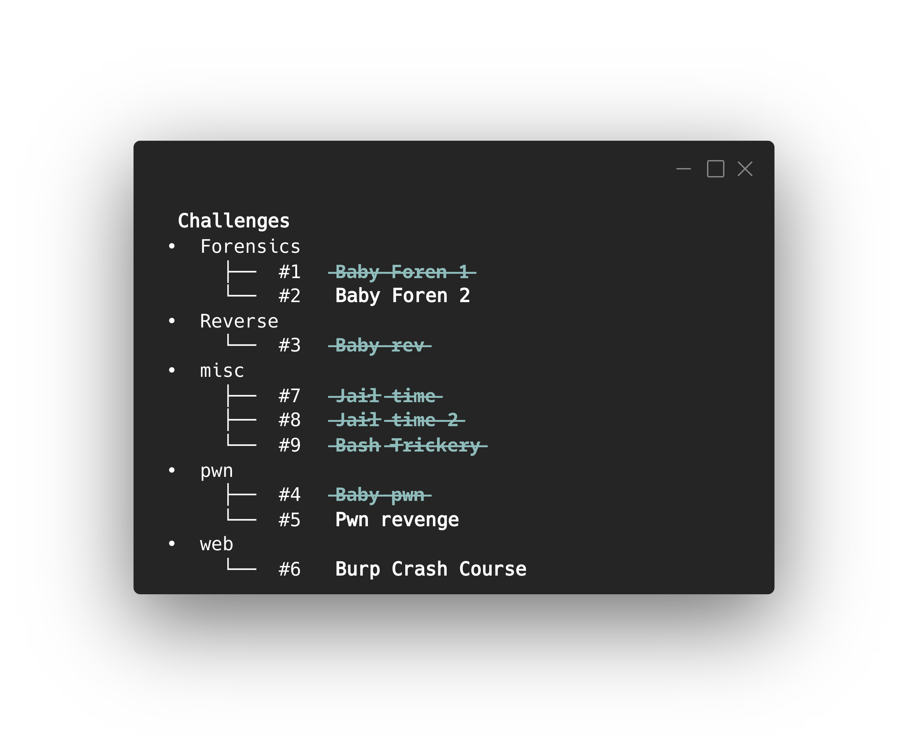

<h1 align="center"> butler </h1>

Helper utility to make playing CTFs a little less messy.

## Usage  
Current functionality mainly consists of three options:  
#### start:  
To start a new ctf  
You must specify a name, url to the `CTFd` instance, and an api token.   
  
This will generate a new directory `~/ctf/{ctf-name}` with two files `challenges.json` containing challenge list and `credentials.txt` which contains the url and api token.  
#### list:  
To generate a nice little tree of the available challenges along with their IDs.  

#### attempt:  
This will create a new directory `~/ctf/{ctf-name}` under for the challenge and download the challenge's files onto it.  
Note that currently download filenames are not preserved.
